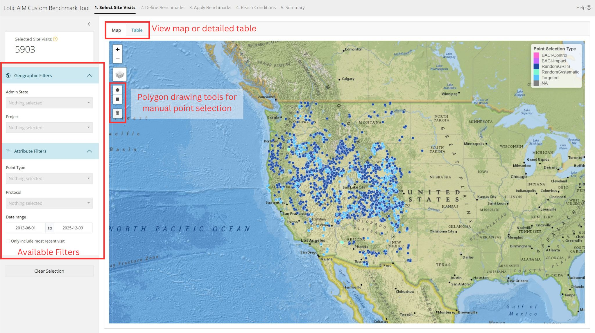
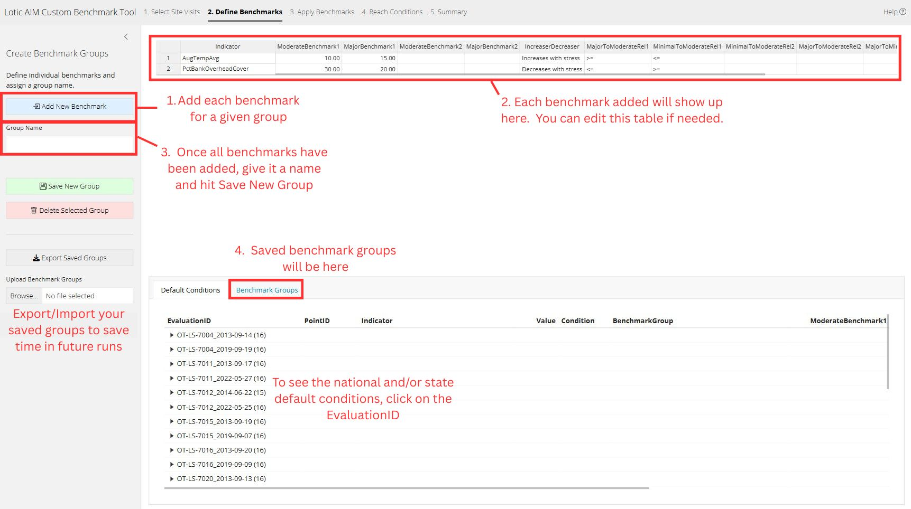
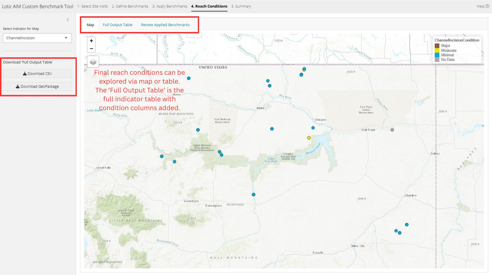
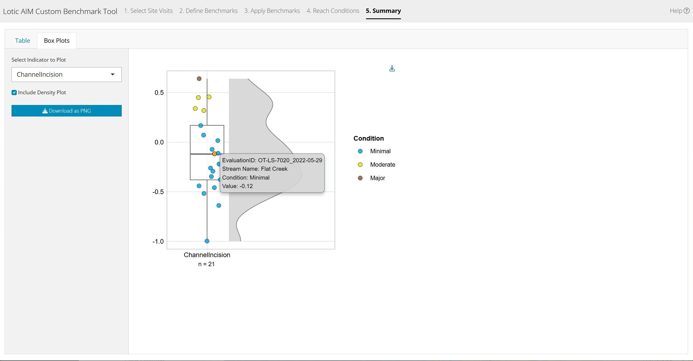

# Lotic AIM Custom Benchmark Tool Help

Welcome to the Lotic AIM Custom Benchmark Tool! This application allows users to define and apply custom benchmarks to Lotic AIM data for stream condition assessment.  This help document will guide you through the main features and workflow of the application.

## 1. Selecting Indicators

Lotic AIM points are shown on the map and there are two methods of choosing points for analysis: filtering and manual selection. The app will switch which points are to be used for analysis based on the selection method. If points are only filtered, all filtered points will be used in the analysis. If any points are manually selected, the selected points become the points used for analysis.

**Filtering**

Use the various filters in the left-hand side bar to choose points for analysis. You will see the result of the filtered points on the map and the *Seleced Site Visits* value in the upper left. Selection by filtering is often sufficient to isolate the points of interest.

**Manual Selection**

For a finer grained selection, points can be manually selected by either clicking on the point or drawing a polygon around using the map tools. Manually selected points are colored red. As soon as a manual selection is made, the app will only consider manually selected points for analysis. This will be reflected in the *Selected Site Visits* count.

If you change any of the filters after performing manual selections, the filter will override the selection and all manually selected points will be deselected.

{width="1000"}

## 2. Define Benchmarks

Once points have been selected for analysis, the custom benchmarks can be defined. Broadly, we add multiple benchmarks into a single group and then define as many benchmark groups as needed. The *Default Conditions* tab shows the state and/or national default conditions and benchmark values for all of the currently selected points. This is largely meant to be a reference while creating custom benchmarks. Once groups are defined, the user can export/import the values to save time in future analysis. The typical workflow is:

1.  Add benchmarks for a single indicator. Clicking the *Add New Benchmark* button will open a pop-up window where the thresholds for the benchmark are defined.
2.  As individual benchmarks are created, they will show up in the table in the main panel. The table is editable but the user should cautious when doing so.
3.  Once all benchmarks have been added to the table, enter a name in the text field and select *Save New Group*.
4.  Benchmark groups will be visible in the *Benchmark Groups* tab. Expand the group by clicking the name or triangle shaped toggle.

{width="1000"}

## 3. Apply Benchmarks

After defining all desired benchmark groups, they can be applied to the points. The table shows all *EvaluationIDs* selected for analysis and all *Indicators* included in any of the defined benchmark groups. Each cell is a drop-down menu where the user can select the desired benchmark group for the given *EvaluationID/Indicator* combination. The *Default* value in the cells means the state default values will be used if available. If there are no state defaults, national defaults will be used. To speed up the entry of the same benchmark group across multiple cells, you can copy the contents of selected cells by dragging around the lower right corner of the selection. For reference, selecting a row in the table will highlight the point on the map.

{width="1000"}

## 4. Reach Conditions

Reach conditions can be viewed and downloaded in a few ways. The map simply shows the condition of the points colored by the selected indicator condition. The *Full Output Table* contains all of the information and metadata included in the standard indicator table with the addition of reach conditions for applied benchmarks. The *Review Applied Benchmarks* tab shows an interactive table organized to more easily view the conditions of the reach. The *Full Output Table* can be downloaded as a comma separated values (CSV) file or, if this data will be used in GIS applications, as a GeoPackage.

{width="1000"}

## 5. Summary

A summary table and box plots are generated for review. Both can be easily downloaded. Note that the box plot is interactive and displays point information when hovering over a point.

{width="1000"}